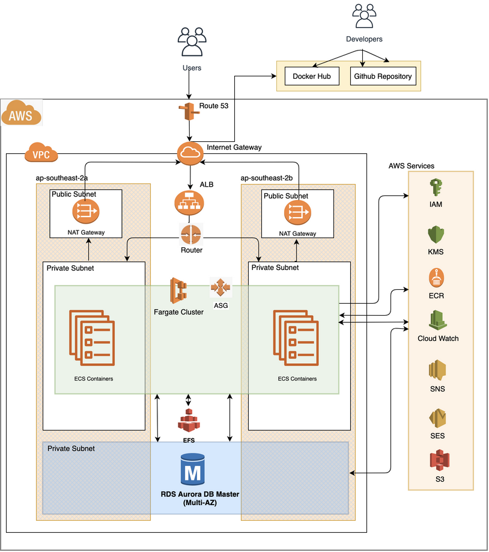

     

### __PROJECT TITLE:__ 

    MIGRATION OF ON-PREMISES WEB APP TO CLOUD

### __PROJECT GROUP__
    
    DEVOPSACADEMY - PROJECT - GROUP3

### __TEAM MEMBERS:__

     -  Daniel Andrade
     -  Fernando Rolnik
     -  Jay Amaranayake
     -  Vanitha Kaliyaperumal
     
### __MENTORS__

      - CAIO TREVISAN 
      - DENIS SILVA
      - KIKO COLLET
    

Table of Contents
=================

   * [Current Business Status](#current-business-status)
      * [Business Requirement](#business-requirement)
      * [Assumptions](#assumptions)
   * [Technology Solution - Getting Started](#technology-solution---getting-started)
      * [Pre-Requisites](#pre-requisites)
      * [Installation Steps](#installation-steps)
   * [Deployment / Usage](#deployment--usage)
   * [Application CICD / Automation](#application-cicd--automation)
   * [Recommendations](#recommendations)
   * [Resources](#resources)
   * [License](#license)

# Current Business Status
A company in Australia currently have a web application running on-premisis in a Linux virtual machine. The application is being used by hundreds of customers every day and it is based on Wordpress which uses LAMP stack (Linux, Apache, MySQL and PHP) to offer great products.

Currently the solution is hosted in a single server (application and database) and deployments are made through FTP transfers to the server.

 

## Business Requirement
The CEO is worried that a traffic peak may bring down the website whih is a great loss to the business as a whole.
The CEO wanted to migarte the On-premesis Web Application to AWS cloud and below are the requirements for the pilot migration project. 

*  Containeraize the application using Docker.
*  The application needs to be secure (all data encrypted at rest and in transit).
*  The application needs to be Highly Available.
* The application needs to support peaks of up to 10 times the average load (scalability).
* The infrastructure needs to be reproducible and version controlled in case the CEO decides to expand the business to other parts of the world (consider infra as code).
* There must be an easy and secure way of developing, with fast feedback (consider CI/CD practices or at least automation scripts).
* Strategy for Logging and Alarming the health of the system.
* Strategy for handling application component failure.

## Assumptions

1. Data Migration is out of scope as it is a pilot migration.
2. Consider to include the Unit/Integration/service test in the CI pipeline or automation scripts.
3. Single GitHib repo will be delivered.
4. This pilot migration will be delivered using Terraform code.

# Technology Solution - Getting Started

__Technology Products / Services__

Below are the Technology Products chosen to deliver this pilot Migration solution.

| REQUIREMENT                  |  TECHNOLOGY                  |
|------------------------------|:-----------------------------|
|  Version Control System(VCS) |  GitHub                      |
|  Infra as Code               |  Terraform                   |
|  PipeLine Tools              |  GitHub Actions              |
|  Containerization            |  Docker / Docker - Compose   |
|  Relational Database         |  AURORA RDS MySQL Serverles  |
|  Container orchestrator      |  ECS FARGATE                 |
|  Container Registry          |  ECR                         |

Solution diagram showing Technology Products/Services and the traffic flow is shown below. 

 

## Pre-Requisites

Below are the pre-requisite that needs to be setup for the team to go ahead with the provisioning of Cloud Infrastructure and application build.

| No  |  PRE-REQUISITE                                    | WEBSITE / REFERENCE                                                             |
|-----|:--------------------------------------------------|:--------------------------------------------------------------------------------|
|  1  | AWS Account Creation                              | [AWS Console](https://aws.amazon.com/console/)                                  |
|  2  | Terraform Install - Teams member's laptop         | [Terraform Download](https://www.terraform.io/downloads.html)                   |
|  3  | GitHub Install - Team member's laptop             | [GitHub Install](https://github.com/)                                           |
   4  | GitHub Repository Creation                        | [GitHub Repo](https://github.com/github/)                                       |
|  5  | AWS CLI Install - Team member's laptop            | [AWS CLI](https://docs.aws.amazon.com/cli/latest/userguide/install-cliv2.html)  |
|  6  | Docker Install - Team member's laptop             | [Docker Install](https://www.docker.com/get-started)                            |
|  7  | JQ Installation -Team member's laptop             | [Jq Install](https://github.com/stedolan/jq/wiki/Installation)                  |
|  8  | Install Make                                      | [GNU Make](https://www.gnu.org/software/make/)                                  |
|  9  | Domain Name Registration                          | [Free Domain](http://www.dot.tk/en/index.html?lang=en)                          |
| 10  | Adding Nameserver for Domain                      | [Add Nameserver](./docs/NewDomain.md)                                       |
| 11  | Create TLS/SSL Certificates                       | [AWS Certificate Manager](https://docs.aws.amazon.com/acm/latest/userguide/gs-acm-request-public.html). Also refer [SSL Creation](./docs/SSL-TLS.md)|
| 12  | Create SNS Topic and Subscription Confirmation    | [Alarming](./docs/LoggingandAlarming.md)                                      |
| 13  | Create CloudWatch Rules                           | [Alarming](./docs/LoggingandAlarming.md)                                       |

## Installation Steps

> Installation of Wordpress Application requires the Infrastructure to be available to deploy the application. Below are the different stages of Application Installation and readiness.
  
   1. [Infrasture Readiness](terraform/modules/networking/README.md)
   2. [Database Installation](terraform/modules/rds-aurora/README.md)
   3. [Application Installation](terraform/modules/ecs/README.md)
   4. [Securing Application](./docs/SSL-TLS.md)
   5. [Logging and Alarming](./docs/LoggingandAlarming.md)

# Deployment / Usage 

Requirements:

* [Dockerfile](./terraform/docker/Makefile)
  
* [Makefile](./terrform/Makefile)

**Deployment Steps:**
Execute the below steps to deploy the Application using Terraform Automation.

1. Plan terraform deploy with container tag
>       make plan

2. Apply Terraform to deploy the application.
>       make apply
   
3. Login to the Elastic Container Registry.
>       make login

4. Build Wordpress Container Image 
>       make build

5. Publish the docker image to ECS Registry - ECR
>       make publish

6. Redeploy with Updated Image.
>       make deploy-wp

To do the deployment in one go, just execute the below command and the above 6 steps will be automatically run to deploy the application.
>      make all

To destroy all the AWS resources deployed as part of Terraform, execute below command.
>       make destroy

# Application CICD / Automation

Below are the steps to be followed to run automatic deployment of application cluster.

#  Recommendations

- Improvements

-  Features not delivered in this Phase

# Resources

[WORDPRESS BEST PRACTISE](https://aws.amazon.com/blogs/architecture/wordpress-best-practices-on-aws/)

[AUTOMATING WORDPRESS](https://medium.com/@beBrllnt/from-30-minutes-to-10-seconds-automating-wordpress-setup-5ff7526942c0)

# License

[LICENSE](./LICENSE)

