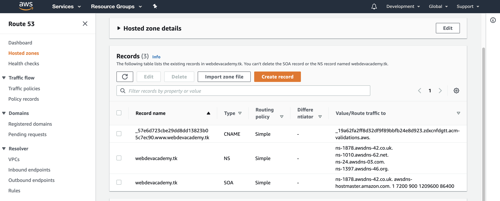

     

## __PROJECT TITLE:__ 

    MIGRATION OF ON-PREMISES WEB APP TO CLOUD

## __PROJECT GROUP__
    
    DEVOPSACADEMY - PROJECT - GROUP3

## __TEAM MEMBERS:__

Team "Devopsacademy Project Group3" consists of 4 tech nerds for the delivery of the Pilot project.

     -  Daniel Andrade
     -  Fernando Rolnik
     -  Jay Amaranayake
     -  Vanitha Kaliyaperumal

Table of Contents
=================

   * [Current Business Status](#current-business-status)
      * [Business Requirement](#business-requirement)
         * [Deliverables](#deliverables)
         * [Assumptions](#assumptions)
   * [Technology Solution - Getting Started](#technology-solution---getting-started)
      * [Technology Products / Services](#technology-products--services)
      * [Pre-Requisites](#pre-requisites)
      * [Installation Steps](#installation-steps)
         * [I. Infrastructure Readiness](#i-infrastructure-readiness)
         * [II. Database Installation and Setup](#ii-database-installation-and-setup)
         * [III. Application Installation](#iii-application-installation)
         * [IV. Securing Application](#iv-securing-application)
         * [V. Logging and Alarming](#v-logging-and-alarming)
      * [Deployment Automation](#deployment-automation)
      * [Application Automation](#application-automation)
      * [Recommendations](#recommendations)
      * [Resources](#resources)
      * [License](#license)
      * [Business Sign-OFF](#business-sign-off)

# Current Business Status
A company in Australia currently have a web application running on-premisis in a Linux virtual machine. The application is being used by hundreds of customers every day and it is based on Wordpress which uses LAMP stack (Linux, Apache, MySQL and PHP) to offer great products.

Currently the solution is hosted in a single server (application and database) and deployments are made through FTP transfers to the server.

 

__Business Problem Statement__

The CEO is worried that a traffic peak may bring down the website whih is a great loss to the business as a whole.

## Business Requirement
The CEO wanted to migarte the On-premesis Web Application to AWS cloud and below are the requirements for the pilot migration project. 

*  Containeraize the application using Docker.
*  The application needs to be secure (all data encrypted at rest and in transit).
*  The application needs to be Highly Available.
* The application needs to support peaks of up to 10 times the average load (scalability).
* The infrastructure needs to be reproducible and version controlled in case the CEO decides to expand the business to other parts of the world (consider infra as code).
* There must be an easy and secure way of developing, with fast feedback (consider CI/CD practices or at least automation scripts).

__Project Timeline__

The pilot project is expected to be completed and reviewed by mid August 2020, and ready for demostration on **17th August 2020**

### Deliverables
* A solution diagram containing all the components of the solution and explaining the data flow.
    
* Automatic Deployemnt strategy.
* Strategy for Logging and Alarming the health of the system.
* Strategy for handling application component failure.
* List Improvements or Features not delivered in this phase

### Assumptions

1. Data Migration is out of scope as it is a pilot migration.
2. Consider to include the Unit/Integration/service test in the CI pipeline or automation scripts.
3. Single GitHib repo will be delivered.
4. This pilot migration will be delivered using Terraform code.

# Technology Solution - Getting Started

## Technology Products / Services
 After detailed brainstroming discussion and also considering the timelines of delivery, it is best to go with serverless in every layer of architecture possible. 
This way the infrastructrue resources are managed by AWS and gives good High Availability and Reliability to AWS resources. 

Below are the Technology Products chosen to deliver the Migration solution.

| REQUIREMENT                  |  TECHNOLOGY                  |
|------------------------------|:-----------------------------|
|  Version Control System(VCS) |  GitHub                      |
|  Infra as Code               |  Terraform                   |
|  PipeLine Tools              |  GitHub Actions              |
|  Containerization            |  Docker / Docker - Compose   |
|  Relational Database         |  AURORA RDS MySQL Serverles  |
|  Container orchestrator      |  ECS FARGATE                 |
|  Container Registry          |  ECR                         |

## Pre-Requisites
Below are the pre-requisite that needs to be setup for the team to go ahead with the provisioning of Cloud Infrastructure and application build.

| No  |  PRE-REQUISITE                                    | WEBSITE / REFERENCE                                                             |
|-----|:--------------------------------------------------|:--------------------------------------------------------------------------------|
|  1  | AWS Account Creation                              | [AWS Console](https://aws.amazon.com/console/)                                  |
|  2  | Terraform Install - Teams member's laptop         | [Terraform Download](https://www.terraform.io/downloads.html)                   |
|  3  | GitHub Install - Team member's laptop             | [GitHub Install](https://github.com/)                                           |
   4  | GitHub Repository Creation                        | [GitHub Repo](https://github.com/github/)                                       |
|  4  | AWS CLI Install - Team member's laptop            | [AWS CLI](https://docs.aws.amazon.com/cli/latest/userguide/install-cliv2.html)  |
|  5  | Docker Install - Team member's laptop             | [Docker Install](https://www.docker.com/get-started)                            |
|  8  | JQ Installation -Team member's laptop             | [Jq Install](https://github.com/stedolan/jq/wiki/Installation)                  |
|  9  | Domain Name Registration                          | [Free Domain](http://www.dot.tk/en/index.html?lang=en)                          |
| 10  | Adding Nameserver for Domain                       | See Section-1                                                                   |
| 11  | Solution Architecture Review and Acceptance       | Check Deliverables section                                                      |
| 12  | Create TLS/SSL Certificates                       | [AWS Certificate Manager](https://docs.aws.amazon.com/acm/latest/userguide/gs-acm-request-public.html). See also, Section-2|
| 13  | Create SNS Topic and Subscription Confirmation    | See Section-3                                                                   |
| 14  | Create CloudWatch Rules                           | See Section-4                                                                   |

**Section-1 Adding Nameserver for Domain**

Ideally,the existing Application Web domain needs to be re-pointed to the new Application Load balancer in AWS Cloud so that the traffic can flow to the new application installed in AWS Cloud. But as this is Pilot, a new domain will be registered (using the free domain provider as per table above) to confirm the functionality of the application before Migration. Below are the steps to be followed as pre-requisite - 

Step 1 - Login to the Free Domain provider and register for a Domain Name.

Step 2 - Login to AWS Console and go to Route53 Console. Create a **Hosted Zone** with the new domain name registered. Note down the Name Server details created for this Domain.

Step 3 - Login to Free Domain provider again, and go to **My Domains** and choose the new domain registered. Go to **Manage Domains** and then to **Management Tool** add the new nameserver details provided by AWS (in step 2) under Custom Name server.

**Section-2 Create TLS/SSL Certificates**

To enable secure connectivity to the Webserver, the TLS/SSL certificates are required.

Login to AWS Console and go to AWS Certificate Manager. Choose **Request Certificates** and choose Request Public Certificates. Provide the Domain name details, and choose DNS validation. Review the choices and confirm to submit the request. The Certificates are created at this stage but the staus is Pending Validation"

A CNAME Details will be created at this stage which needs to be updated in Route53 DNS records. This can be done by clicking on the button **Create Record in Route53** from the ACM Console or go to Route53 console and create a simple routing Record set under the hosted zone's Domain name.

**Section-3 Create SNS Topic and Subscription Confirmation**

Business requires Alarming to be enabled for monitoring Application Health Checks. 

AWS Simple Notification service helps to address this sending Notification emails to subscribers about the Application Health status changes. 

To enable simple email notification service, below are the steps to be followed.

Step 1 - Create SNS Topic

Go to AWS Console and go to **Simple Notification Service(SNS)** Console. Choose **Create Topic** and provide a name for the SNS Topic and click Create Topic.

Step 2 - Create Subscription

Go to SNS Console, and choose **Create Subscribtions**. Choose the Topic ARN created from step1, and provide Email as Protocol and Email address as Endpoint. Click Create Subscription. Go to your email and check for email from AWS and confirm subscription. 

Step 3 - Create Cloudwatch Rules

Please see section-4 on configuring Cloudwatch rules.

**Section-4 Create CloudWatch Event Rules**

AWS Resources can generate events when the staus of the resource changes. Cloudwatch events (now called as Amazon EventBridge) can be configured to capture these events and deliver near real time stream of system events that describe changes to the AWS resources to targets (in our case SNS).

For the Webserver Application, we need to monitor the Container services where the Wordpress application is running. 
To Enable CloudWatch Events for Containers, go to AWS Console and then to AWS CloudWatch Console. Choose **Events** and then **Rules** and click **Create Rules**.

For For Event Source, choose Event Pattern. From the dropdown choose custom event pattern. Copy and paste the text as shown in the image below. 

For Targets, choose “Add Targets” and choose SNS Topic. Choose the SNS topic name provided in step1 in Section-3. Click “Configure Details”. Provdide a name for Rule and also provide a small Description. Then click **Create Rule** and CloudWatch event rule is created for ECS Clusters Health check.

## Installation Steps

Considering the Business requirement on containeraisation of application components, High Availability and Security of the systems, it is decided to go with AWS serverless services wherever possible. It is decided to go with serverless services like
 - FARGATE for Containerisation of Application, 
 - RDS Aurora Serverless for Database

Installation of Wordpress Application requires the Infrastructure to be available to deploy the application. Terraform is used for the creation of Infrastructure and related Networks.  

Below are the different stages of Application Installation and readiness.
   1. Infrasture Readiness
   2. Application Installation
   3. Securing Application
   4. Logging and Alarming

### I. Infrastructure Readiness

Considering the Business and its customers are specific to Australia, the Cloud region where the Infrastructure will be built is chosen as **Sydney**, that is **ap-southeast-2** region. The infrastructure is built across 3 availability zones to achieve High Availabiity, Reliability of AWS services in case of diaster.
  
 
__1. Network Configuration__
Network configuration and setup plays a key role in setting up the AWS services in Cloud. Below are the key Network components configured and designed considering HA, Scalable, Reliability and more Secure.

__1.1 VPC Creation__
Amazon Virtual Private Cloud is a Virtual private Network where the scalable AWS Resources are

__1.2 Subnet Creation__
In progress - to be updated

__1.3 Security Group Creation__
In progress - to be updated

__1.4 Internet Gateway Creation__
In progress - to be updated

__1.5 NAT Gateway Creation__
In progress - to be updated

__1.6 Route Table Setup__
In progress - to be updated

__1.7 Network Access Control List (NACL) setup__
In progress - to be updated

__2. Load Balancer Setup__
In progress - to be updated

__3. Shared Storage Setup__
In progress - to be updated

### II. Database Installation and Setup
In progress - to be updated

### III. Application Installation

__1. Image Creation__

__2. Registry Upload__
In progress - to be updated

__3. ECS FARGATE Setup__
In progress - to be updated

### IV. Securing Application
In progress - to be updated

### V. Logging and Alarming
In progress - to be updated

## Deployment Automation

DockerFile

MakeFile

Automatic Deployment Steps

## Application Automation

Below are the steps to be followed to run automatic deployment of application cluster.

##  Recommendations

- Improvements

-  Features not delivered in this Phase

## Resources

[WORDPRESS BEST PRACTISE](https://aws.amazon.com/blogs/architecture/wordpress-best-practices-on-aws/)

[AUTOMATING WORDPRESS](https://medium.com/@beBrllnt/from-30-minutes-to-10-seconds-automating-wordpress-setup-5ff7526942c0)

## License

[LICENSE](./LICENSE)

## Business Sign-OFF

>| __DENIS SILVA__     |     __CAIO TREVISAN__      |      __KIKO COLLET__     |
>|---------------------|:---------------------------|:-------------------------|
>|                  |                         |                       |
>|                     |                            |                          |

