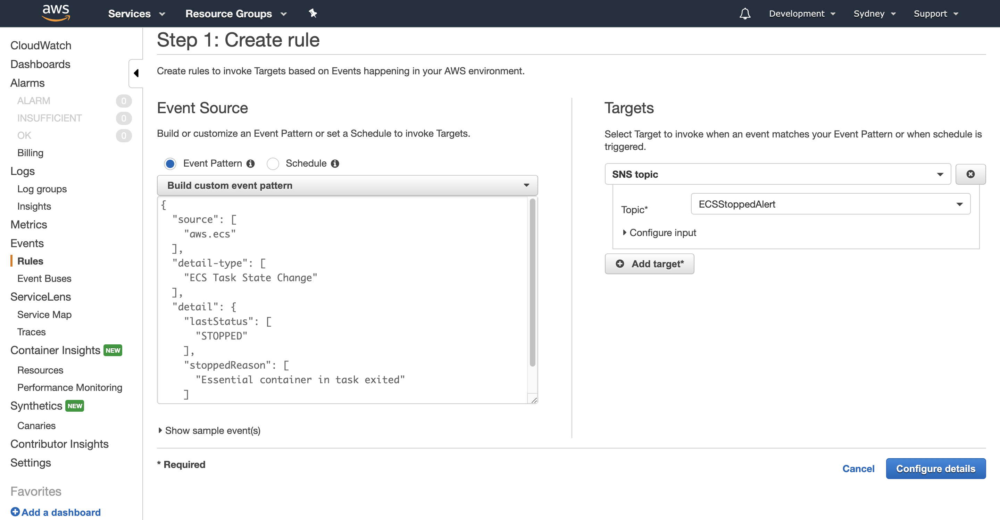

## ALARMING

AWS Simple Notification service can be used for alarming by sending Notification emails to subscribers about the Application Health status changes. 
AWS SNS is configured to capture the change in event status of FARGATE Containers and alert/send notification through Email. 

NOTE - As Terraform dont support SNS with Email Notification, this step need to be done manualy.

 1. Create SNS Topic 

Go to AWS Console and go to **Simple Notification Service(SNS)** Console. Choose **Create Topic** and provide a name for the SNS Topic and click Create Topic.

2. Create Subscription

Go to SNS Console, and choose **Create Subscribtions**. Choose the Topic ARN created from step1, and provide Email as Protocol and Email address as Endpoint. Click Create Subscription. Go to your email and check for email from AWS and confirm subscription. 

3. Create Cloudwatch Rules

To Enable CloudWatch Events for FARGATE Containers, go to AWS CloudWatch Console. Choose **Events** and then **Rules** and click **Create Rules**.

Select Event Source, and Event Pattern. From the dropdown choose custom event pattern. Copy and paste the text as shown in the image below. 

For Targets, choose “Add Targets” and choose SNS Topic. Choose the SNS topic name provided in step1 in Section-3. Click “Configure Details”. Provdide a name for Rule and also provide a small Description. Then click **Create Rule** and CloudWatch event rule is created for ECS Clusters Health check.

## LOGGING

ECS FARGATE Container creation mandates AWS Cloud Watch Log groups creation, without which the Containers wont start.
Please refer [ECS FARGATE](../terraform/modules/ecs/main.tf) and [CloudWatch Logs](../terraform/modules/ecs/logs.tf) creation.

